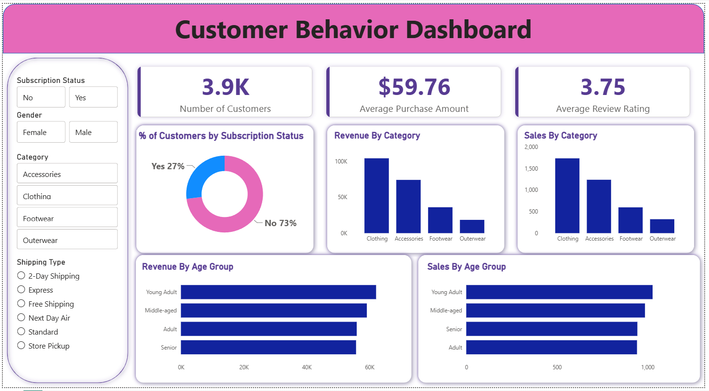

# Customer Shopping Behavior Analysis

End-to-end data analytics project that takes raw retail transaction data from **Python (cleaning & feature engineering)** → **PostgreSQL (business-question SQL)** → **Power BI (interactive dashboard)**, answering 10 real-world customer behavior questions for a retail stakeholder.


[](https://www.kaggle.com/code/bravewolf03/customer-shopping-behavior-revenue)

📊 **[View on Kaggle](https://www.kaggle.com/code/bravewolf03/customer-shopping-behavior-revenue)** — runs end-to-end with a single "Run All" (SQLite instead of PostgreSQL, no local setup needed)

## Table of Contents

- [Overview](#overview)
- [Workflow](#workflow)
- [Dataset](#dataset)
- [Repository Structure](#repository-structure)
- [Business Questions Answered](#business-questions-answered-sql)
- [Dashboard](#dashboard)
- [Key Insights](#key-insights)
- [Tech Stack](#tech-stack)
- [How to Reproduce](#how-to-reproduce)
- [Project Report](#project-report)
- [License](#license)
- [Contact](#contact)

## Overview

A retail dataset of **3,900 customer transactions** is cleaned and feature-engineered in Python, loaded into a PostgreSQL database, queried with SQL to answer 10 business questions (revenue drivers, discount behavior, customer segmentation, product performance), and summarized in an interactive Power BI dashboard. The goal was to simulate a realistic analyst workflow end-to-end, from raw CSV to stakeholder-ready insights.

## Workflow


`Business problem → EDA & feature engineering in Python → Load to PostgreSQL → SQL analysis → Power BI dashboard → Project report → GitHub`

## Dataset

- **Rows / Columns:** 3,900 customers x 18 raw fields (19 after feature engineering)
- **Fields:** demographics (age, gender, location), transaction details (item, category, purchase amount, payment method), engagement signals (review rating, subscription status, discount/promo usage, previous purchases, purchase frequency), and logistics (shipping type)
- **Cleaning & feature engineering** (see [`notebooks/`](notebooks)):
  - Filled 37 missing `review_rating` values with the category-level median
  - Standardized column names (lowercase, snake_case)
  - Dropped `promo_code_used` — found to be a 100% duplicate of `discount_applied`
  - Engineered `age_group` (Young Adult / Adult / Middle-aged / Senior via quartile split)
  - Engineered `purchase_frequency_days` (mapped purchase-frequency labels to a numeric day count)
  - Loaded the cleaned dataframe into PostgreSQL via SQLAlchemy

## Repository Structure

```
customer-shopping-behavior-analysis/
├── README.md
├── LICENSE
├── requirements.txt
├── .env.example
├── notebooks/
│   └── Customer_Shopping_Behaviour_Analysis.ipynb   # data cleaning, feature engineering, load to PostgreSQL
├── sql/
│   └── customer_behavior_sql_queries.sql            # 10 business questions in SQL
├── data/
│   └── customer_shopping_behavior.csv                # raw dataset
├── dashboard/
│   └── customer_behavior_dashboard.pbix              # Power BI dashboard
├── reports/
│   └── PROJECT_REPORT.md                              # full write-up: methodology, findings, recommendations
└── assets/
    ├── workflow_diagram.png
    ├── dashboard_preview.png
    └── sql_screenshots/                                # Q1-Q10 pgAdmin4 query output screenshots
```

## Business Questions Answered (SQL)

All queries in [`sql/customer_behavior_sql_queries.sql`](sql/customer_behavior_sql_queries.sql), output screenshots in [`assets/sql_screenshots/`](assets/sql_screenshots). SQL techniques used: aggregation, subqueries, `CASE` logic, `CTE`s, and window functions (`ROW_NUMBER() OVER PARTITION BY`).

| # | Question | Technique |
|---|----------|-----------|
| Q1 | Total revenue: male vs. female customers | `GROUP BY`, `SUM` |
| Q2 | Customers who used a discount but still spent above the average | Correlated subquery |
| Q3 | Top 5 products by average review rating | `GROUP BY`, `ORDER BY`, `LIMIT` |
| Q4 | Avg. purchase amount: Standard vs. Express shipping | `GROUP BY`, filtering |
| Q5 | Do subscribers spend more? Avg spend & total revenue, subscribers vs. non-subscribers | `GROUP BY`, aggregation |
| Q6 | Top 5 products by percentage of purchases with a discount applied | Conditional aggregation (`CASE`) |
| Q7 | Segment customers into New / Returning / Loyal by purchase history | `CTE` + `CASE` |
| Q8 | Top 3 best-selling products within each category | `CTE` + `ROW_NUMBER() OVER (PARTITION BY ...)` |
| Q9 | Are repeat buyers (5+ purchases) more likely to be subscribers? | Filtered `GROUP BY` |
| Q10 | Revenue contribution by age group | `GROUP BY`, `ORDER BY` |

## Dashboard



Interactive Power BI dashboard (`dashboard/customer_behavior_dashboard.pbix`) with slicers for subscription status, gender, category, and shipping type, covering:
- Headline KPIs — customer count, average purchase amount, average review rating
- Subscription split
- Revenue & sales by product category
- Revenue & sales by age group

## Key Insights

- **Male customers drove ~68% of total revenue** ($157,890 vs. $75,191 from female customers), roughly tracking the male-skewed customer base in the dataset.
- **Subscription status does not predict higher spend.** Subscribers spent $59.49 on average vs. $59.87 for non-subscribers — essentially flat. Non-subscribers generated far more *total* revenue ($170,436 vs. $62,645) simply because they're 73% of the customer base — subscription is a retention lever, not a spend lever.
- **Discounting is concentrated in specific products, not blanket-applied.** Hats (50%), Sneakers (49%), and Coats (49%) had the highest share of discounted purchases, while some categories relied much less on discounting.
- **Shipping speed barely moves basket size.** Express shipping customers spent only ~$2 more on average than Standard ($60.48 vs. $58.46) — shipping preference is not a strong spend signal.
- **The customer base is overwhelmingly loyal by tenure:** 3,116 of ~3,900 customers (80%) fall into the "Loyal" segment (11+ previous purchases), with only 83 "New" customers — suggesting this snapshot captures a mature, retained customer base rather than new acquisition.
- **Most high-frequency repeat buyers (5+ purchases) are *not* subscribed** (2,518 vs. 958 subscribed), reinforcing that loyalty here is behavioral, not tied to the subscription program.
- **Revenue is fairly evenly spread across age groups**, with Young Adults contributing the most ($62,143) and Seniors the least ($55,763) — no single age group dominates.
- **Top-rated products skew toward accessories/footwear** — Gloves (3.86), Sandals (3.84), and Boots (3.82) lead average review ratings.

Full methodology, all 10 query results, and detailed recommendations are in [`reports/PROJECT_REPORT.md`](reports/PROJECT_REPORT.md).

## Tech Stack

| Layer | Tools |
|-------|-------|
| Language | Python 3 |
| Data wrangling | pandas |
| Database | PostgreSQL, pgAdmin4 |
| DB connectivity | SQLAlchemy, psycopg2 |
| Analysis | SQL (aggregations, CTEs, window functions) |
| Visualization | Power BI |
| Environment | Jupyter Notebook |
| Version control | Git, GitHub |

## How to Reproduce

```bash
# 1. Clone the repo
git clone https://github.com/SubhranshuPan/customer-shopping-behavior-analysis.git
cd customer-shopping-behavior-analysis

# 2. Create a virtual environment and install dependencies
python -m venv venv
source venv/bin/activate   # Windows: venv\Scripts\activate
pip install -r requirements.txt

# 3. Configure database credentials
cp .env.example .env
# edit .env with your local PostgreSQL credentials

# 4. Create the target database in PostgreSQL
createdb customer_behaviour

# 5. Run the notebook to clean the data and load it into PostgreSQL
jupyter notebook notebooks/Customer_Shopping_Behaviour_Analysis.ipynb

# 6. Run the SQL queries
# Open sql/customer_behavior_sql_queries.sql in pgAdmin4 (or psql) against the customer_behaviour database

# 7. Explore the dashboard
# Open dashboard/customer_behavior_dashboard.pbix in Power BI Desktop
```

> Database credentials are loaded from a local `.env` file (see `.env.example`) — no credentials are hardcoded anywhere in this repo.

## Project Report

A full write-up — business problem, cleaning steps, every SQL result, and recommendations — is available at [`reports/PROJECT_REPORT.md`](reports/PROJECT_REPORT.md).

## License

This project is licensed under the [MIT License](LICENSE).

## Contact

**Subhranshu Panda**
Email: [subhranshu599@gmail.com](mailto:subhranshu599@gmail.com)
LinkedIn: [linkedin.com/in/subhranshu03](https://www.linkedin.com/in/subhranshu03/)
